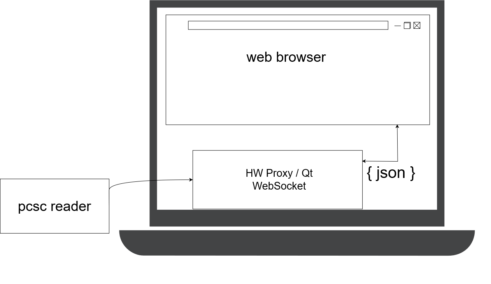

# SmartCard Proxy / HW Access over Websocket
It provides to access your local hardware from inside your browser . It is possible to send ISO7816 APDU commands to card reader through websocket . Qt and C++ has been used for this tool

